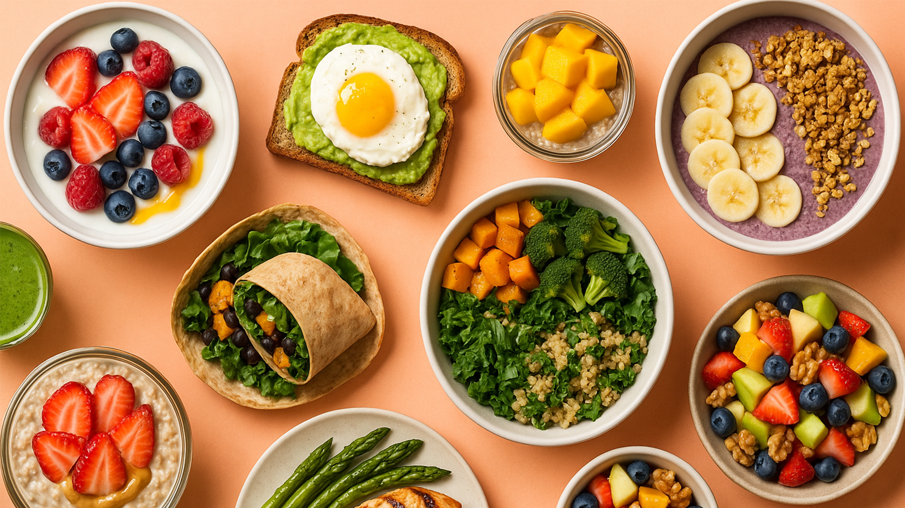

Collecting workspace information# AI Nutrition Tracker

## Overview

AI Nutrition Tracker is a modern web application that helps users understand the nutritional content of their food through two powerful interfaces: **image recognition** and **natural language AI chat**. Simply upload a photo of your meal or ask nutrition-related questions to get instant insights.



## Key Features

### 🖼️ Food Detection & Analysis
- Upload food images via drag-and-drop or file selection
- Automatic food identification using Facebook's DETR-ResNet50 object detection model
- Real-time nutritional information retrieval from USDA FoodData Central API

### 💬 AI Nutrition Assistant
- Chat interface with an AI nutrition expert powered by Qwen3-0.6B language model
- Get answers about calories, nutrients, dietary recommendations, and more
- Intelligent response formatting with highlighted information

### 📱 User Experience
- Seamless interface switching between chat and image upload modes
- Responsive design that works across devices
- Clean, intuitive UI with smooth animations and visual feedback

## Tech Stack

- **Backend**: Django (Python web framework)
- **Machine Learning**: 
  - Object Detection: Facebook's DETR (DEtection TRansformer) with ResNet-50 backbone
  - NLP: Qwen3-0.6B language model for nutrition-related chat responses
- **APIs**: USDA FoodData Central API for comprehensive nutritional data
- **Frontend**: Vanilla JavaScript, HTML5, CSS3 with custom animations
- **Deployment**: Compatible with standard Python web hosting environments

## Installation

1. Clone the repository:
   ```bash
   git clone https://github.com/yourusername/ai-nutrition-tracker.git
   cd ai-nutrition-tracker
   ```

2. Create a virtual environment:
   ```bash
   python -m venv venv
   source venv/bin/activate  # For Unix/MacOS
   # OR
   venv\Scripts\activate  # For Windows
   ```

3. Install dependencies:
   ```bash
   pip install -r requirements.txt
   ```

4. Create a .env file with your USDA API key:
   ```
   USDA_API_KEY=your_api_key_here
   ```
   Get your free API key from: [USDA FoodData Central](https://fdc.nal.usda.gov/api-key-signup.html)

5. Run the development server:
   ```bash
   python manage.py runserver
   ```

6. Visit `http://127.0.0.1:8000/` in your browser to use the application.

## Usage

### Food Image Analysis
1. Click the "Image Upload" tab
2. Drag and drop a food image or click to select a file
3. Click "Analyze Food"
4. View the detected food items and their detailed nutritional information

### Nutrition Chat Assistant
1. Click the "Chat Mode" tab (active by default)
2. Type your nutrition-related question in the input field
3. Get instant answers with key information highlighted
4. Continue the conversation with follow-up questions

## Project Structure

```
ai-nutrition-tracker/
├── food_detector/        # Main Django app
│   ├── templates/        # HTML templates
│   ├── views.py          # View functions handling requests
│   └── urls.py           # URL routing
├── static/               # Static assets
│   ├── css/              # Stylesheets
│   ├── js/               # JavaScript files
│   └── images/           # Images
├── media/                # Uploaded images
├── main.py               # Food detection logic
├── manage.py             # Django management script
└── README.md             # Project documentation
```

## Future Enhancements

- User accounts to save food history and track nutritional intake over time
- Meal planning recommendations based on nutritional goals
- Mobile app version with camera integration
- Expanded food database with regional and cultural specialties

## License

MIT License

## Credits

- Machine learning models from [Hugging Face](https://huggingface.co/)
- Nutritional data from [USDA FoodData Central](https://fdc.nal.usda.gov/)
- Icons by [Font Awesome](https://fontawesome.com/)

---

**Made with ❤️ for better nutrition**